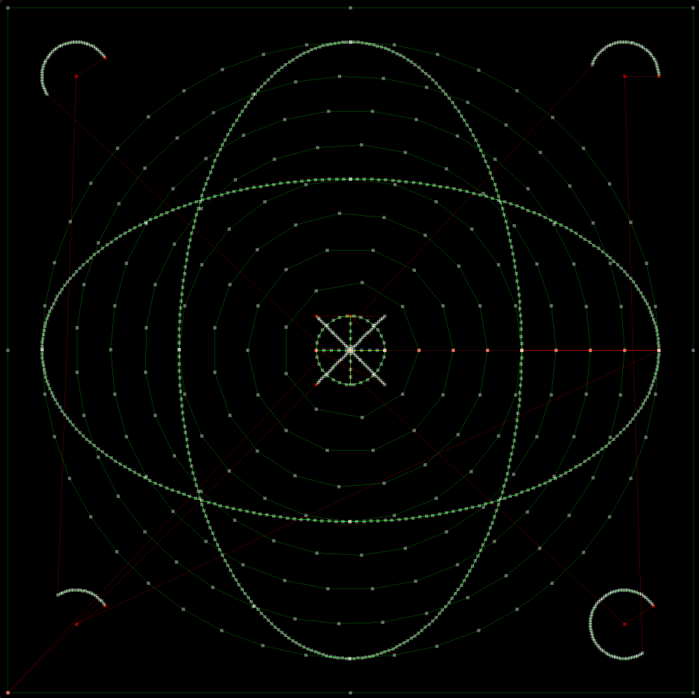

# ESP32 CRT clock
## DACs
  * Use I2S peripheral to generate a continuous bit-stream at 40 MHz
  * Drive 2x MCP4922, sharing the SCLK and DATA pins
  * Use the I2S word-select (WS) line as the SPI chip-select (/CS) for one DAC
  * Use the GPIO matrix to output an inverted copy of WS to the second DAC
  * This interleaved configuration of 2 DACs results in 4 channels, 12 bit, 625 kS/s


## Building
Development is happening on a ESP32-CAM board.
Need platformio installed. Then simply:

```bash
pio run -t upload -t monitor
```

## SDL2 simulator
the `test_draw/` directory contains a CRT simulator. It uses SDL2 for outputting
to the screen and runs the same drawing code as the ESP32. This is useful
for developing new features and troubleshooting.



### building and running on Debian / Ubuntu
```bash
sudo apt-get install build-essential libsdl2-dev
cd test_draw
make

./test draw_list.csv
```
