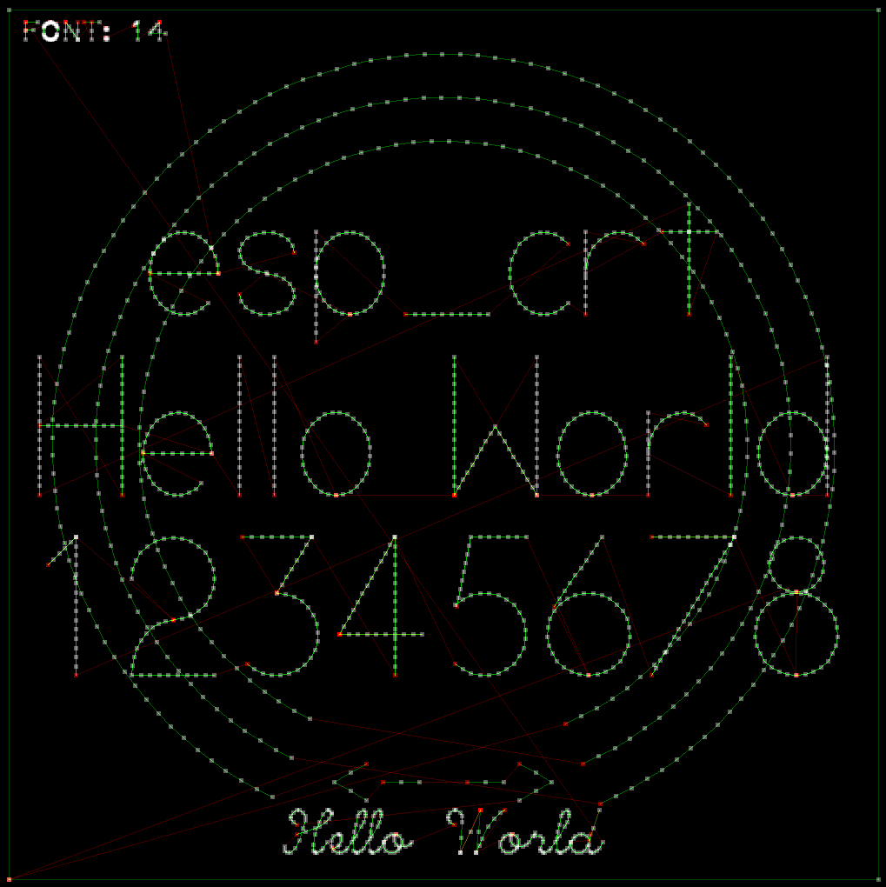
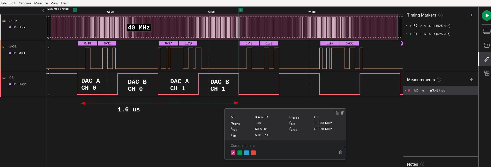

# ESP32 CRT clock
A scope-clock and general purpose CRT driver for the ESP32.

Implemented features:

  * 4 DAC channels (X, Y, blanking, focus) driven at a fixed sample rate (625 kHz) by the ESP32 DMA
  * One core is dedicated to drawing and generating the sample stream. The other core handles communication
  * Drawing functions for lines, ellipses, filled rectangles, quadratic bezier curves and cubic bezier curves
  * Drawing functions move the beam at constant velocity to achieve even brightness
  * Drawing commands can be serialized in a compressed byte-stream (`draw_blob()`)
  * Font engine. A python tool is provided (`dev/fonts/font_covnerter.py`) to convert .ttf, .otf, .woff2 files to .c files
  * The glyphs are rendered in firmware using the original bezier curves. No loss of precision even for huge font sizes
  * Full unicode and UTF-8 support
  * Tiny wireframe 3D engine
  * DDS mode: draw advanced Lissajous figures. Parameters adjustable in realtime from a web-browser.
  * Weather forecast for Switzerland based on the meteo-swiss API (Pictograms and 2D plots)
  * User interface over a single rotary encoder
  * Code can run in a simulator on PC or webbrowser

Not yet implemented features / ideas:

  * User interface over a rotary encoder and a toggle-switch for mode dependent adjustments. Or maybe a second rotary encoder
  * Airplane tracking based on the OpenSky API
  * 3D engine with hidden surface removal
  * Support for user-provided applications
  * A marketplace with live-preview to share user-provided applications



[Web-browser demo](https://michael-betz.github.io/esp32_crt)

Use the left and right arrow keys to switch screens.

## DACs
  * The I2S peripheral generates a continuous bit-stream at 40 MHz
  * It drives 2x MCP4922, sharing the SCLK and DATA pins
  * The I2S word-select (WS) line is used as the SPI chip-select (/CS) for one DAC
  * The ESP32 GPIO matrix is used to output an inverted copy of WS to the second DAC
  * This interleaved configuration of 2 DACs results in 4 channels, 12 bit, 625 kS/s



## Building
Right now there are 3 ways to build this project.

### ESP32 (platformio)
The main target for this project is an ESP32 on the [dac_board_esp32](https://github.com/michael-betz/crtdriver2/tree/main/dac_board_esp32) PCB (not published yet). I'm using the esp-idf SDK and [platformio](https://platformio.org/) as a build tool.

To build the project and flash it to the esp, use this command from the linux command line:

```bash
pio run -t upload -t monitor
```

### SDL2 simulator
I tried to make the vector-drawing code platform independent. This makes it possible to have a CRT simulator running on a PC, which is very useful for developing new features and troubleshooting.

The simulator uses SDL2 for drawing on the screen and simulates the additive brightness of the phosphor.

Here's how to build and run the simulator on Debian / Ubuntu

```bash
# install dependencies
sudo apt-get install make clang libsdl2-dev curl

# build
cd test_draw
make

# run
./test
```

You can turn the rotary encoder with the left and right arrow keys to switch screens.

### Web-assembly build
The simulator can be built for the web-browser. This requires emscripten, which will output a .wasm, .js, .data and .html file. If these are served from a webserver, the simulator will run in the browser.

Install the same dependencies as above. Then manually install emscripten from git, [as described here](https://emscripten.org/docs/getting_started/downloads.html).

Debian does provide a emscripten package on apt but it didn't work for me as during the build process emscripten tries to download additional extensions, which failed due to not having write access if installed as a system package.

```bash
# install emscripten
git clone https://github.com/emscripten-core/emsdk.git
cd emsdk
./emsdk install latest
./emsdk activate latest

# build
source ./emsdk_env.sh
cd test_draw
make wasm

# run
cd dist/
emrun index.html
```
